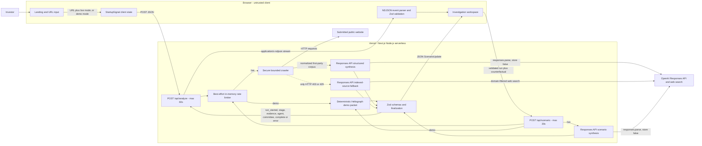
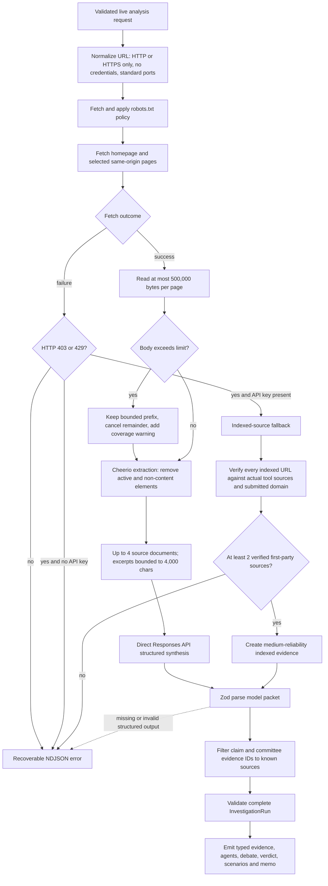
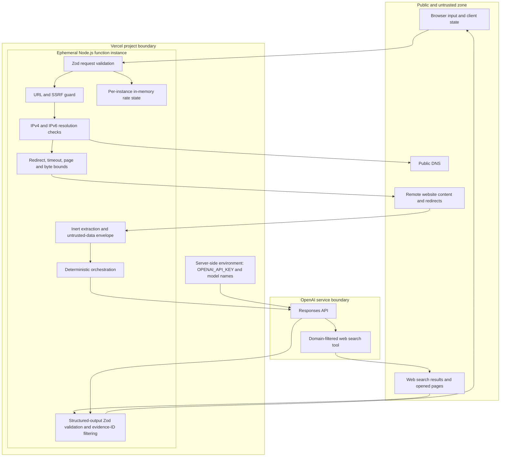

# StartupSignal Architecture

StartupSignal is a Next.js App Router application that turns a company URL into a typed investment investigation. The browser renders a progressive command-center workspace, while all crawling, model access, URL security checks, and API keys remain inside Node.js serverless routes. Demo and live investigations converge on the same `InvestigationRun` contract.

## System context and request flow

The analysis route starts an NDJSON stream immediately. Demo mode emits deterministic staged events with short presentation delays. In live mode, discovery progress is emitted before a single structured Responses API synthesis; evidence, specialist, committee, and completion events are emitted after the returned packet passes validation. The OpenAI call itself is not token-streamed to the browser.

## Live investigation pipeline

Direct crawling never fails solely because a page is larger than 500 KB. It retains the first 500,000 bytes, cancels the response stream, and carries a `SOURCE TRUNCATED` warning into the validated result. Only the homepage is mandatory; inaccessible secondary pages are skipped. Crawling is limited to the submitted origin, four pages, three redirects, eight seconds per fetch, supported text content types, and useful product/company paths.

The direct path sends only the bounded, normalized website corpus to `responses.parse`. If the homepage responds with HTTP 403 or 429, the indexed path instead requires web search, restricts it to the submitted hostname, cross-checks model-declared sources against returned tool sources and URL citations, rejects off-domain URLs, and requires at least two verified first-party sources. Indexed evidence is labeled medium reliability and its limitation is preserved in warnings.

## Trust and deployment boundaries

The SSRF guard blocks local/internal hostnames, credentials, non-standard ports, and private, reserved, link-local, multicast, documentation, and metadata IP ranges. DNS A and AAAA answers are checked before every fetch, including redirects; redirect targets are normalized and revalidated. This application-level check reduces risk but cannot replace network egress controls for high-assurance DNS-rebinding protection.

Remote HTML and search material are always data, never instructions. Active elements are removed, excerpts are bounded, source text is placed inside an explicit untrusted-data envelope, and system instructions prohibit following embedded commands or inventing unsupported facts. Model output must satisfy narrow Zod schemas; unknown evidence references are removed before the final run is parsed again.

## Runtime characteristics

| Area | Current behavior | Production implication |
| --- | --- | --- |
| Execution | One `POST /api/analyze` invocation, capped at 60 seconds | Broader research needs a durable queue and persisted run state |
| Streaming | Server-generated NDJSON events; `no-store` and `no-transform` | Keeps the workspace responsive without a separate realtime service |
| Demo | Keyless, deterministic fictional dataset | Reliable fallback independent of external sites and model availability |
| Persistence | Browser memory only | Refreshes and cross-device access do not preserve investigations |
| Rate limiting | Per-IP map in a warm function instance | Use a distributed store before broad public exposure |
| Evidence scope | Up to four first-party pages, or verified first-party indexed sources after 403/429 | Independent press, repositories, social sources, and broad diligence are not included |
| Secrets | `OPENAI_API_KEY` read only by server route code | Never prefix the API key with `NEXT_PUBLIC_` |
| Model state | Responses requests use `store: false` | The app owns no durable provider-side conversation or agent loop |

The scenario endpoint accepts a validated completed run and a bounded counterfactual. Demo scenarios are deterministic. Live scenarios call the Responses API without gathering new evidence, validate a `ScenarioUpdate`, and append the result to client state and the memo change log.
